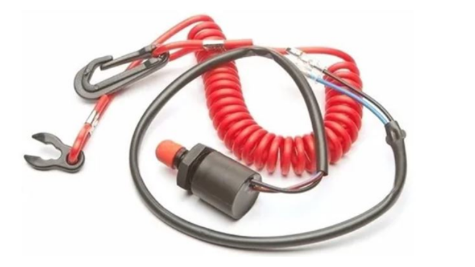
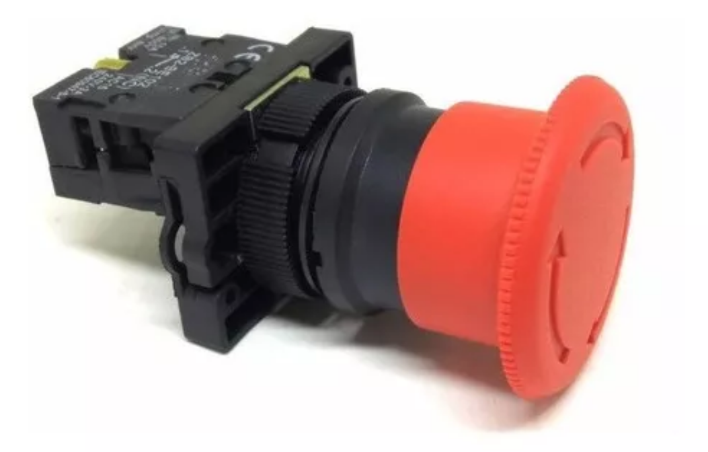
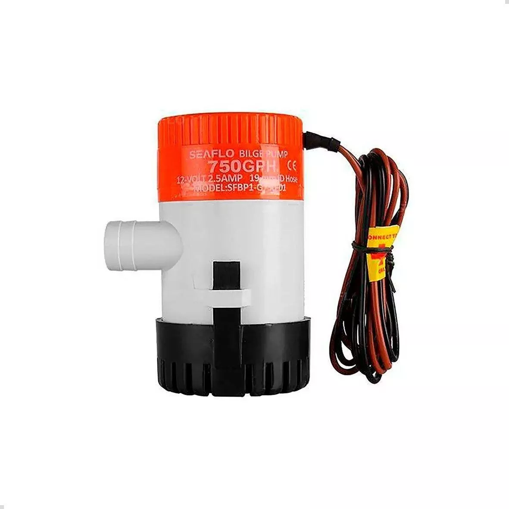
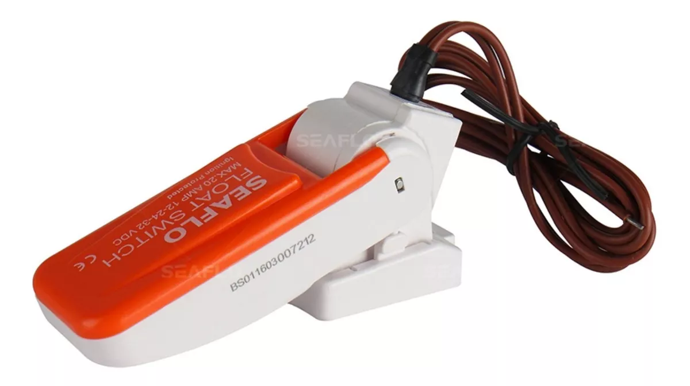
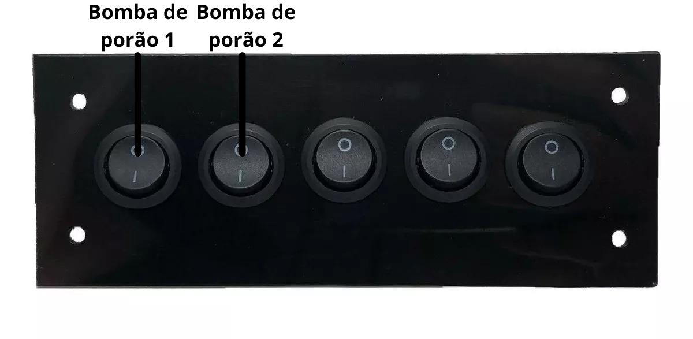

Sistemas de Segurança
====

Por se tratar de uma embarcação tripulada, o Floki conta com vários recursos de segurança que esperamos que ninguém nunca tenha que usar.

Deadman's switch
------

Uma chave semelhante às utilizadas em esteiras ergônomicas. Um cabo é preso no colete salva vidas do piloto e a outra ponta é presa na chave.
Caso o piloto puxe o cabo ou saia do barco o circuito abre e todo o sistema é desligado.

.. note:: Para encontrar esse produto é preciso pesquisar por "Chave Cordão Segurança Jetsky Barco Motor Popa Yamaha Botão"

Chave Geral
------

De forma análoga ao Deadman's switch, a Chave Geral é mais uma forma de desligar o barco

.. image:: imagens/seguranca/chave_geral

Botão de emergência
------

De forma análoga à Chave Geral, o Botão de emergência é mais uma forma de desligar o barco

Buzina
------

A buzina utilizada é uma universal para motos.

.. image:: imagens/seguranca/buzina.webp

As bombas de porão
------

As bombas de porão tem a finalidade de remover água de dentro do barco. É normal que um pouco de água entre no barco, mas caso isso aconteça em excesso, as bombas de porão são acionadas para remover esse excesso de água.

Existem dois mecânismos para o acionamento dessa bomba. 

O primeiro é são as chaves automáticas da bomba de porão. Essas chaves são bóias fixas no assoalho da embarcação. Na presença de água, a bóia levanta e aciona a bomba.

O segundo mecanismo, é através de um botão no painél do piloto.

Radio VHF
------

O Rádio VHF tem o objetivo de ser o meio de comunicação para casos excepcionais. Ele se encontra abaixo do painel do piloto e conta com uma alimentação independendo da chave geral do barco. 

