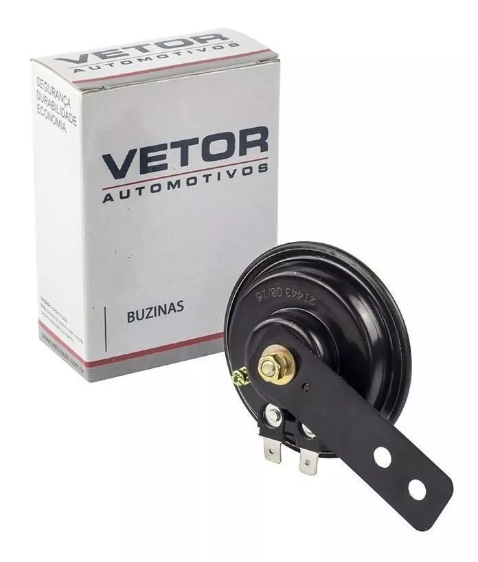

Sistemas de Segurança
====

Por se tratar de uma embarcação tripulada, o Floki conta com vários recursos de segurança que esperamos que ninguém nunca tenha que usar.

Deadman's switch
------

Uma chave semelhante às utilizadas em esteiras ergônomicas. Um cabo é preso no colete salva vidas do piloto e a outra ponta é presa na chave.
Caso o piloto puxe o cabo ou saia do barco o circuito abre e todo o sistema é desligado.

.. note:: Para encontrar esse produto é preciso pesquisar por "Chave Cordão Segurança Jetsky Barco Motor Popa Yamaha Botão"

Chave Geral
------

De forma análoga ao Deadman's switch, a Chave Geral é mais uma forma de desligar o barco

Botão de emergência
------

De forma análoga à Chave Geral, o Botão de emergência é mais uma forma de desligar o barco

Buzina
------

A buzina utilizada é uma universal para motos.

As bombas de porão
------

As bombas de porão tem a finalidade de remover água de dentro do barco. É normal que um pouco de água entre no barco, mas caso isso aconteça em excesso, as bombas de porão são acionadas para remover esse excesso de água.

Existem dois mecânismos para o acionamento dessa bomba. 

* O primeiro é são as chaves automáticas da bomba de porão. Essas chaves são bóias fixas no assoalho da embarcação. Na presença de água, a bóia levanta e aciona a bomba.

.. figure:: imagens/seguranca/boia.webp
   :align: center

* O segundo mecanismo, é através de um botão no painél do piloto.

Radio VHF
------

O Rádio VHF tem o objetivo de ser o meio de comunicação para casos excepcionais. Ele se encontra abaixo do painel do piloto e conta com uma alimentação independendo da chave geral do barco. 

Ventiladores
------

O inteiror do Floki conta com alguns coolers para aumentar o fluxo de ar e ajudar no resfriamento interno da embarcação.

Circuito de Segurança
------

Também chamado de "sistema auxiliar", esse circuito é responsável por garantir o funcionamento dos itens de do Floki.

* A primeira parte do circuito de segurança é a chave geral. Com ela desligada, a bateria para de fornecer tensão para todo o barco, com excessão do Controlador de Carga.

* A segunda parte do circuito de segurança tem a função de interromper o fornecimento de energia ao motor. Isso é feito com o uso de um conjunto de relês que é desligado com *deadman`s switch* ou *botão do motor* no :ref:`PainelPiloto`

* A terceira parte do circuito é o sistema responsável por acionar a buzina através de um botão no :ref:`PainelPiloto`

* A quarta parte do circuito é responsável por alimentar as bombas de porão através das bóias de segurança e botões no :ref:`PainelPiloto`

* A quinta parte do circuito é responsável por alimentar os ventiladores internos.